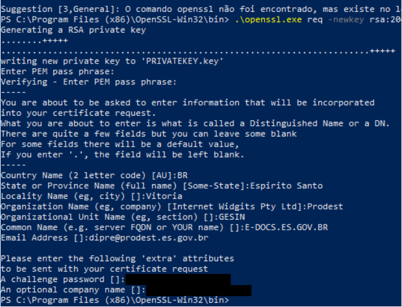
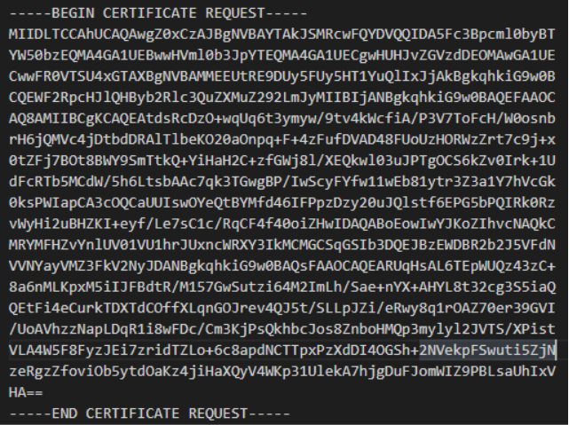
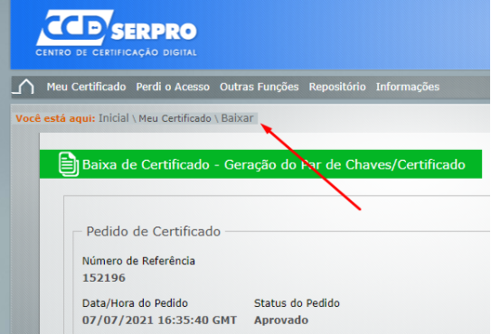
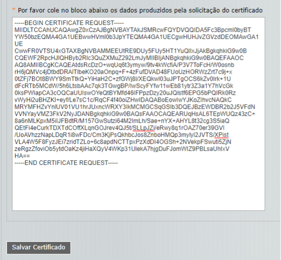
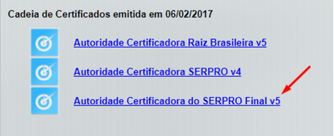
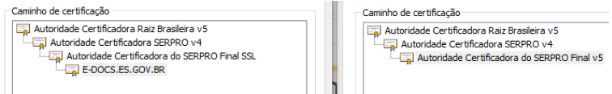
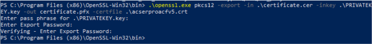

**Como gerar um certificado pfx para o E-Docs**

**Instale o openssl**  

*https://www.openssl.org/*

**Solicitação de Assinatura de Certificado**  

Primeiramente, precisaremos gerar um arquivo de *Solicitação de Assinatura de Certificado*. Este arquivo contém uma mensagem codificada (RSA) e contém os seguintes dados: Common Name (CN), Organization (O) , Organization Unit (OU), City (L), State (S), Country (C), Email Address e chave pública.

`openssl req -newkey rsa:2048 -keyout privatekey.key -out mycsr.csr`

O openssl solicitará que o usuário crie uma senha (PEM Passphase). Também serão solicitados alguns dados que compõem o Distinguished Name (DN), além de uma outra senha (Challenge Password).

Ao final deste passo, será criado um arquivo contendo a *Solicitação de Assinatura de Certificado* (.csr) e um arquivo contendo a *chave privada* (.key) que faz par com a chave pública contida no arquivo csr.

O arquivo csr será solicitado como entrada por algum formulário da aplicação do emissor para que um certificado no formato p7b seja gerado.

O E-Docs trabalha com certificados no formato pfx, então precisamos converter o certificado de p7b para pfx. Essa conversão é feita em dois passos, onde o primeiro passo consiste em gerar um arquivo .cer a partir do p7b.

`openssl pkcs7 -print_certs -in certificate.p7b -out certificate.cer`

A partir deste ponto será necessário baixar o certificado da Autoridade Certificadora (CA), que no nosso exemplo foi a *Serpro*. Este certificado pode ser encontrado no site da serpro sob o seguinte endereço: “https://certificados.serpro.gov.br/serproacf/certificate-chain”. 

A figura abaixo mostra o caminho da certificação p7b do edocs (esquerda) e o caminho da certificação da Serpro (direita).

Para converter o certificado do formato .cer para um certificado no formato .pfx, basta executar o seguinte comando:

`openssl pkcs12 -export -in certificate.cer -inkey privatekey.key -out certificate.pfx -certfile cacert.cer`

No processo de conversão será solicitado que se informe o PEM Passphrase, que foi definido no primeiro passo deste guia. Por fim, será solicitado que seja criada uma senha de exportação (Export Password). 

Entre os artefatos gerados neste guia, para efeito de assinatura digital de documentos, o E-docs precisa apenas do certificado pfx e sua senha de exportação.

