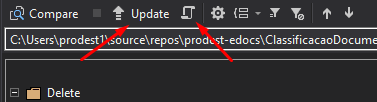

# Sincronização do Banco de Dados x Projeto Database

O projeto **Database**, que é um projeto do tipo **SQL Server Database Project**, possibilita que consigamos manter uma representação da estrutura corrente do banco de dados (Esquema/Schema) dentro do nosso projeto. Este projeto permite que consigamos acompanhar o histórico de alterações do esquema, além possibilitar voltar o esquema do banco para qualquer estado anterior.
O Visual Studio possui uma ferramenta que nos permitem fazer uma comparação entre dois esquemas. Esta ferramenta pode ser encontrada através do seguinte caminho: Tools/Sql Server/New Schema Comparison.

Uma vez selecionadas as duas fontes, basta solicitar que ambas sejam comparadas que o Visual Studio vai apresentar na tela uma lista com todas as difereças entre os esquemas selecionados. No exemplo abaixo, fica evidenciado adição de uma coluna **campoAdicional** na tabela **Agente**.

A partir deste ponto, basta selecionar quais alterações deverão ser aplicadas. O Visual Studio permite que apliquemos as alterações de forma direta, simplesmente executando o update através do **botão update** ou gerando um **script** para posterior execução.

Por fim, vale ressaltar que a ferramenta apenas sincroniza os esquemas selecionados para comparação. Todas as alterações feitas em banco precisam ser refletidas nas **entities** e suas relações adicionadas ao **context**.