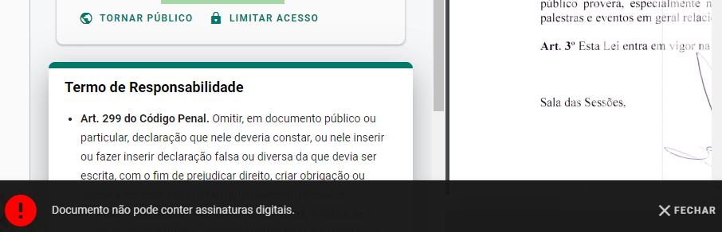

# Exceptions

O E-Docs trabalha com três tipos especializados de exceções: **MisuseException**, **AccessDeniedException** e **BusinessException**.

Cada uma destas exceções possui uma propriedade de nome Error, cujo valor é bem descritivo e especifica qual o tipo de erro capturado. Ex: NullOrEmptyArgument, EmptyList, PastaNotFound, etc.

Além da propriedade **Error**, as classes também possuem a propriedade chamada **CustomMessage**, que tem a finalidade de sobrescrever *Exception.Message* da classe base. Esta propriedade nos dá a oportunidade de mostrar ao usuário ou salvar no log uma mensagem com uma descrição que possa ser mais significativa que apenas o valor do enum Error.

Caso a exceção seja lançada apenas com a informação da propriedade Error, então o nome do enum será lançado como erro. Caso a propriedade CustomMessage seja definida, a propriedade Error será omitida e a mensagem customizada que será lançada.

Erros de requisições Ajax serão filtrados e mostrados numa barra inferior, que irá pipocar com sua respectiva mensagem acompanhada de um botão de fechar.

