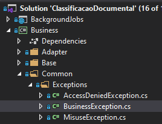

# Exceptions

O E-Docs trabalha com três tipos especializados de exceções: **MisuseException**, **AccessDeniedException** e **BusinessException**.

Cada uma destas exceções possui uma propriedade Error do tipo enum, cujos valores são bem descritivo e definem qual o tipo de erro capturado. Ex: NullOrEmptyArgument, EmptyList, PastaNotFound, etc.

Além da propriedade **Error**, as classes também possuem a propriedade chamada **CustomMessage**, que tem a finalidade de sobrescrever *Exception.Message* da classe base. Esta propriedade nos dá a oportunidade de mostrar ao usuário ou salvar no log uma mensagem com uma descrição que possa ser mais significativa que apenas o valor do enum Error.

No caso do BusinessException, os erros são capturados na camada de Presentation e caso a exceção seja lançada apenas com a informação da propriedade BusinessException.Error, então uma mensagem de erro será lançada de acordo com um dicionário de erros previamente cadastrado em BusinessMessage.Message. Caso a propriedade BusinessException.CustomMessage seja definida, a propriedade BusinessException.Error será omitida e a mensagem customizada que será lançada. 

Já as excessões do tipo MisuseException e StatusCodeAccessDenied são tratadas de forma similar ao BusinessError, mas com a diferença de que essas não possuem um dicionário de mensagens previamente cadastradas.

Todos os erros capturados durante o processamento de uma requisição são adicionados ao ResultViewModel.Messages e estes são apresentados ao usuário numa barra que ocupará a porção inferior da tela e só desaparecerá caso o usuário clique no botão fechar.

