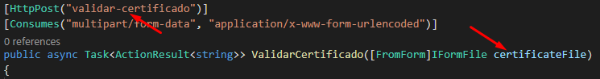

Uma das etapas da **validação** da **assinatura digital** consiste em validar online a **cadeia do certificado**. Entretanto, por questões de boas práticas segurança, foi decidido que o servidor que terá acesso à internet deverá ficar num ambiente em que as requisições https aceitas são únicamente de saída (outbound).

O projeto responsável por fazer esta validação avaliará se o certificado foi **revogado**, se a **cadeia de confiabilidade** é válida e se a raiz do certificado é **ICP-Brasil**. 
O endpoint encarregado da validação aceitará como parâmetro de entrada o certificado de cada assinatura digital e retornará uma mensagem de erro em caso alguma validação falhe.

O certificado enviado ao endpoint é um X509Certificate, que será serializado como byte array no momento do envio e posteriormente reconstruido como X509Certificate dentro do endpoint.

